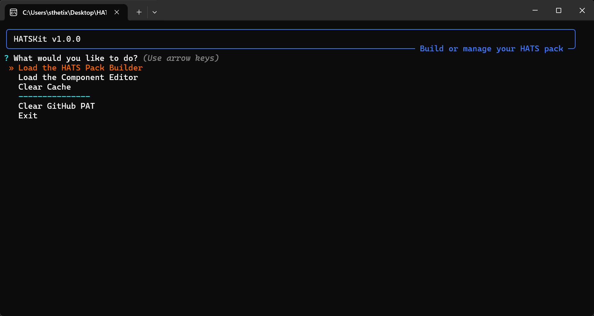

# HATSKit - HATS Pack Builder and Editor

<div align="center">
  
</div>

A powerful Python tool for building custom HATS (Homebrew App & Tool Store) packs for Nintendo Switch homebrew. This tool allows you to create personalized collections of homebrew applications, patches, overlays, and payloads with an intuitive menu-driven interface.

## Features

- **Interactive Component Selection**: Choose from categorized homebrew components
- **GitHub Integration**: Automatically fetches latest releases from GitHub repositories
- **Smart Caching**: Reduces API calls with intelligent cache management
- **Component Editor**: Add, edit, and manage components through a built-in editor
- **Rate Limit Handling**: Gracefully handles GitHub API rate limits
- **Custom Processing**: Supports various file processing operations (unzip, copy, rename, etc.)
- **Build Summary**: Generates detailed reports of your custom pack contents

## Requirements

### Python Dependencies
The script automatically installs required packages if they're missing:
- `requests` - For API calls and downloads
- `questionary` - For interactive CLI menus
- `rich` - For beautiful terminal output

### Required Files
- `components.json` - Component definitions (can be created via the editor)
- `skeleton.zip` - Base structure for HATS packs

## Installation

### Option 1: Download and Run (Recommended)
1. **Download required files:**
   - `hatskit.py` (for Python) OR `HATSKit.exe` (for Windows)
   - `skeleton.zip` 
   - `components.json`
2. **Place all files in the same folder**
3. **Run the tool:**
   - Python: `python hatskit.py`
   - Windows: Double-click `HATSKit.exe`

### Option 2: Build Executable with PyInstaller
1. Install PyInstaller:
   ```bash
   pip install pyinstaller
   ```

2. Build the executable:
   ```bash
   pyinstaller --onefile --name HATSkit --noupx --clean --add-data "components.json;." --add-data "skeleton.zip;." --add-data "languages;languages" --icon icon.ico hatskit.py
   ```

3. The executable will be created in the `dist/` folder

## GitHub Personal Access Token (PAT)

To avoid GitHub API rate limits and access private repositories, you'll need a Personal Access Token:

### Creating a Fine-Grained Token (Recommended)
1. Go to [GitHub Settings > Personal Access Tokens](https://github.com/settings/personal-access-tokens)
2. Click "Generate new token" → "Fine-grained personal access token"
3. Configure the token:
   - **Expiration**: Choose your preferred duration
   - **Repository access**: Select "Public Repositories" (or specific repos if needed)
   - **Repository permissions**: 
     - Contents: Read
     - Metadata: Read
   - **Account permissions**: Leave as default

4. Click "Generate token" and copy it immediately
5. Enter this token when prompted by HATSKit

### Creating a Classic Token (Alternative)
1. Go to [GitHub Settings > Personal Access Tokens > Tokens (classic)](https://github.com/settings/tokens)
2. Click "Generate new token" → "Generate new token (classic)"
3. Select scopes:
   - `public_repo` (for public repositories)
   - `repo` (if you need private repository access)
4. Generate and copy the token

**Note**: Keep your token secure and never share it publicly!

## Usage

### Main Menu Options

1. **Load the HATS Pack Builder**
   - Select components from categorized lists
   - Automatic version detection from GitHub releases
   - Build custom HATS pack ZIP file

2. **Load the Component Editor**
   - View all available components
   - Add new components with wizard
   - Edit existing component configurations
   - Delete unwanted components

3. **Clear Cache**
   - Force refresh of GitHub API data
   - Useful when components aren't updating

4. **Clear GitHub PAT**
   - Remove stored Personal Access Token
   - Useful for switching accounts

### Building a Custom Pack

1. Launch HATSKit
2. Select "Load the HATS Pack Builder"
3. Enter your GitHub PAT when prompted (optional but recommended)
4. Wait for component information to load
5. Select desired components using the checkbox interface:
   - Use arrow keys to navigate
   - Press Space to select/deselect
   - Press 'a' to toggle all
   - Press 'i' to invert selection
   - Press Enter to confirm
6. Review your selections and proceed
7. Wait for the build process to complete
8. Find your custom pack as `HATS_Pack_Custom.zip`

### Component Categories

- **Essential**: Core system components and utilities
- **Homebrew Apps**: Applications and games
- **Patches**: System modifications and improvements
- **Tesla Overlays**: Switch overlay system components
- **Payloads**: Boot-time payloads and tools

## Configuration

### Component Structure (`components.json`)

```json
{
  "component_id": {
    "name": "Component Name",
    "description": "Component description",
    "category": "Essential",
    "default": true,
    "source_type": "github_release",
    "repo": "user/repository",
    "tag": "v1.0.0",
    "asset_pattern": "*.zip",
    "processing_steps": [
      {
        "action": "unzip_to_root"
      }
    ]
  }
}
```

### Processing Step Types

- `unzip_to_root`: Extract archive contents to build root
- `copy_file`: Copy file to specific location
- `unzip_to_folder`: Extract to specific folder
- `find_and_copy`: Find files matching pattern and copy
- `find_and_rename`: Find and rename files
- `delete_file`: Remove specific files

## Command Line Options

```bash
# Clear cache on startup
python hatskit.py --clear-cache

# Or with executable
HATSkit.exe --clear-cache
```

## Output Files

- `HATS_Pack_Custom.zip`: Your custom HATS pack
- `HATS_Pack_Contents.txt`: Detailed build summary
- `hats_pack_cache.json`: API response cache
- `components.json.bak`: Backup of component file

## Troubleshooting

### Common Issues

**"Rate limit exceeded"**
- Solution: Use a GitHub Personal Access Token

**"Component not found"**
- Check if the GitHub repository still exists
- Verify the asset pattern matches available files
- Clear cache to refresh data

**"Skeleton file not found"**
- Ensure `skeleton.zip` is in the same directory as the script
- When building executable, verify the file is properly bundled

**"Permission denied"**
- Run with administrator privileges if needed
- Check file permissions in the script directory

### Cache Management

The cache file (`hats_pack_cache.json`) stores GitHub API responses for 12 hours to reduce API calls. Use "Clear Cache" from the main menu or `--clear-cache` flag to force refresh.

## Contributing

To add new components:
1. Use the built-in Component Editor
2. Test your configurations thoroughly
3. Share your `components.json` additions with the community

## License

This tool is provided as-is for educational and personal use. Please respect the licenses of individual homebrew components and GitHub repositories.

## Support

- Check GitHub Issues for common problems
- Verify your `components.json` syntax with a JSON validator
- Ensure all required files are present
- Test with a GitHub PAT if experiencing rate limits
